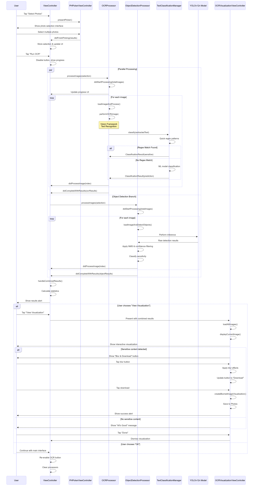

# Blurify!?! - AI-Powered Privacy Protection for Photos

Protecting your privacy, one photo at a time.

An intelligent iOS application that automatically detects and protects sensitive content in your photos using advanced on-device AI, ensuring you never accidentally share personal information online.

## 🌟 Inspiration
The idea for Blurify was sparked by the growing privacy risks faced by content creators and everyday social media users. We noticed how easy it is to accidentally share photos containing sensitive information such as faces, documents, or personal details - especially when posting online. With so much of our lives captured in photos, we wanted to create a solution that puts privacy protection front and center, without adding extra steps or hassle.

## 💡 What it does
Blurify is a photo gallery app that automatically scans your images for sensitive content using on-device AI. Whenever you select photos, Blurify detects elements such as faces, documents, and license plates, then automatically blurs or encrypts those areas to keep your privacy intact. Before sharing or uploading, you can easily review flagged images and unlock or adjust the blurred areas as needed, ensuring you never accidentally overshare personal details.

## 🚀 How we built it
We built Blurify as a native iOS app using Swift to ensure optimal performance and seamless integration with the Photos app. Users can easily import their images directly from their device's photo library. For privacy detection, we leveraged Apple's Vision framework for robust text recognition (OCR), allowing us to extract any visible text from images. This extracted text is then analyzed by our fine-tuned text classification model, which determines whether the information is sensitive or not. In parallel, we employ our customized computer vision model, YOLOv12n, to detect and track sensitive visual elements such as faces, documents, and license plates within the images. By combining advanced OCR and computer vision techniques, all processed on-device, Blurify delivers fast and reliable privacy protection without compromising user data security.

## 🏗️ Technical Architecture

### 📸 Smart Photo Selection
- Multi-selection support with ordered selection using PHPickerViewController
- Comprehensive media support for all iOS-supported formats
- While live photos and video is supported, this capability is not used downstream for our AI model

### 🔍 Advanced OCR (Optical Character Recognition)
- Real-time text detection using Apple's Vision framework
- Intelligent text classification with custom machine learning models
- Confidence scoring and precise bounding box visualisation

### 🤖 Object Detection with YOLOv12n
- Custom YOLOv12n model for real-time sensitive object detection
- Non-Maximum Suppression for accurate, non-overlapping detections
- Configurable confidence thresholds for optimal performance

### 🛡️ Privacy Protection System
- Visual blur effects with customizable intensity for sensitive content
- Downloadable censored images with blur-only processing (no visible bounding boxes)
- Detailed result printed for extra observability
- Bounding boxes overlaying the original image with red dots denoting a bounding box that contain sensitive content

## 🧠 AI Models & Processing
### Text Classification Pipeline
- Hybrid regex + ML approach for optimal accuracy and speed
- Multi-pattern regex matching for immediate PII detection
- Fine-tuned classification models for complex text analysis
- Category-specific confidence scoring with performance metrics

### Object Detection Pipeline
- YOLOv12n model integration optimized for mobile deployment
- Custom sensitive object definitions based on privacy research
- Real-time inference with sub-second processing times
- Memory-efficient model loading for optimal iOS performance

## 🛠️ Technical Implementation

### ViewController.swift
Main orchestrator handling photo selection and coordinating dual-processor architecture for OCR and Object Detection.

### OCRProcessor.swift
Advanced text recognition engine featuring:
- Custom text classification models
- Regex-based pattern matching for immediate detection
- Confidence threshold filtering
- Sequential image processing with progress tracking

### ObjectDetectionProcessor.swift
Intelligent object detection system using:
- Core ML integration with YOLOv12n
- Real-time object classification
- Sensitive object filtering algorithms
- Performance-optimized inference pipeline

### OCRVisualizationViewController.swift
Sophisticated visualization interface providing:
- Interactive image viewing with smooth zoom/pan
- Blur effects for sensitive content
- Export functionality to export images with bounding boxes
- Detailed detection analytics and reporting

### TextClassificationManager.swift
Hybrid text classification system combining:
- Multi-pattern regex matching for speed
- Machine learning model integration for accuracy
- Category-specific confidence scoring
- Efficient batch processing capabilities

## 🔧 Setup Requirements
iOS 14.0+ for PHPickerViewController support
Xcode 12+ for development and deployment
Text classification models in Models folder:
- model_info.pkl
- tfidf_transformer.pkl
- regex_transformer.pkl
- classifier_only.pkl
- YOLOv12n model (yolo12n.mlmodelc) 

## 💪 Challenges we ran into
One of our biggest challenges was the constraint of running all AI processes on-device, which meant our models had to be both highly capable and small enough to fit within the memory limits of an iPhone. Initially, we experimented with compact large language models like DeepSeek-R1-Distill-Qwen-1.5B and Llama-3.2-3B-Instruct for text classification using prompt engineering. However, these models proved too slow in practice and delivered underwhelming performance out of the box. Given these limitations, as well as time and compute constraints, we pivoted to alternative approaches for text classification.

Another significant hurdle was defining what constitutes personally identifiable information (PII). The range of PII categories is vast, and within the tight timeframe of a hackathon, it was not feasible to build a comprehensive dataset or train models to accurately classify so many different types. As a result, we had to carefully scope our detection criteria and focus on the most common and critical types of sensitive information for our initial prototype.

## 🔮 What's next for Blurify!?!
- Research more <3B Small Language Models and fine-tune them for our specific use case
- Utilize larger YOLO models and fine-tune to identify various text types in addition to objects
- Understand more deeply ways to squeeze out compute power on the iPhone to support Small Language Models efficiently
- Automated background checks in the app instead of having to manually upload photos and download after blurring
- Expand PII detection categories to cover more types of sensitive information
- Cloud-optional processing for users who want more powerful models with privacy guarantees
- Integration with social media platforms for seamless privacy-protected sharing

## 🙏 Acknowledgments
This project incorporates and extends code from Apple's official documentation:

[Selecting Photos and Videos in iOS](https://developer.apple.com/documentation/photokit/selecting-photos-and-videos-in-ios)

The foundation for PHPickerViewController integration and media handling is based on Apple's sample implementation, enhanced with our advanced AI-powered privacy protection capabilities.