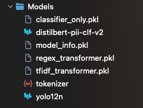
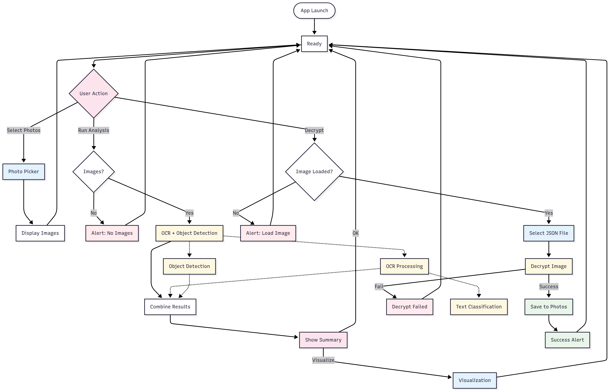
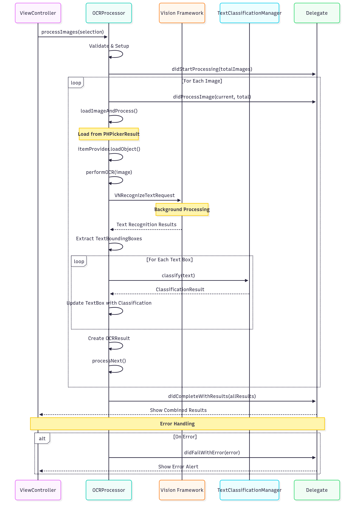
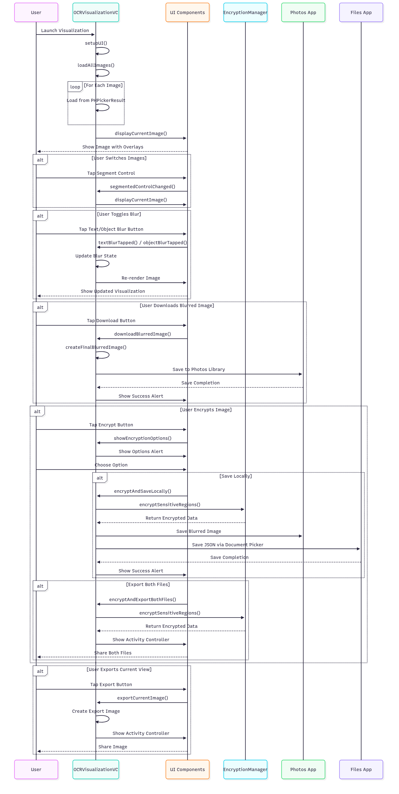
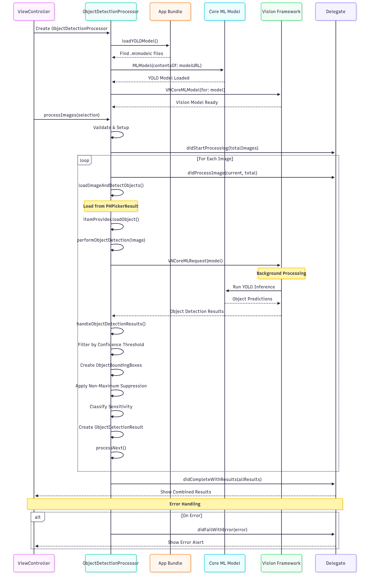
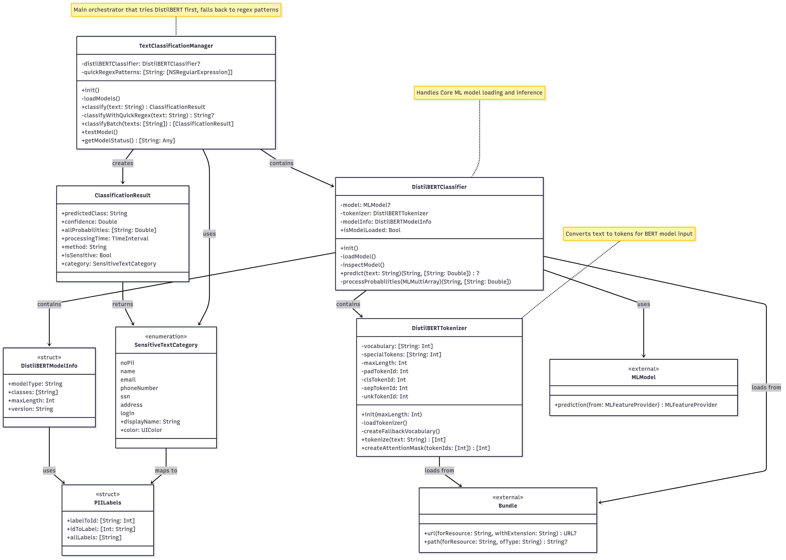
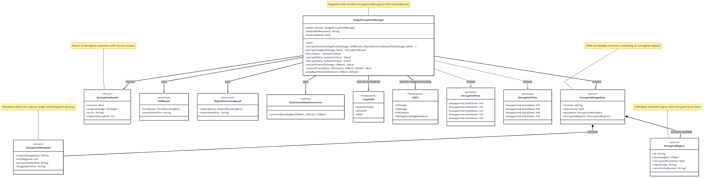

# Blurify!?! - AI-Powered Privacy Protection for Photos

Protecting your privacy, one photo at a time.

An intelligent iOS application that automatically detects and protects sensitive content in your photos using advanced on-device AI, ensuring you never accidentally share personal information online.

Blurify is a photo gallery app that automatically scans your images for sensitive content using on-device AI. Whenever you select photos, Blurify detects elements such as faces, documents, and license plates, then automatically blurs or encrypts those areas to keep your privacy intact. Before sharing or uploading, you can easily review flagged images and unlock or adjust the blurred areas as needed, ensuring you never accidentally overshare personal details.

## 🔧 Setup Requirements
- iOS 14.0+ for PHPickerViewController support
- Xcode 12+ for development and deployment
- Text classification & Object Detection models in Models folder
- Deployed on an iPhone (preferably 14 and above)

## Getting Started

1. Clone the Repository
    ```bash
    git clone https://github.com/tiktok-tech-jam-2025/ByteMyBrains-Swift.git
    cd ByteMyBrains-Swift
    ```

2. Open up folder on XCode

3. Prepare Models

    Please refer to the following repositories for the models to be generated:
    - [Regex Classifier](https://github.com/tiktok-tech-jam-2025/image_processors/blob/menghan-post-processing/ocr_model_classifier.py)
    - [YOLOv12n](https://github.com/tiktok-tech-jam-2025/ByteMyBrains-YOLO)
    - [DistilBert](https://github.com/tiktok-tech-jam-2025/ByteMyBrains_DistilBERT)

    <b>We do strongly advise reading the `YOLOv12n` and `DistilBert` READMEs before diving deeper into this application's README.</b>

    The models generated will need to be placed in `./Models` folder at root as seen here:

    

    For simplicity, we have provided this link to access our models directly: [Google Drive](https://drive.google.com/file/d/1DTMDybSGP0jqyGG6Qu6UCukmugHfYzEh/view?usp=sharing)


## 🏗️ Technical Architecture
### ViewController.swift


Implements the main view controller for an iOS app that allows users to select images/videos, perform OCR and object detection, classify sensitive information, and restore blurred images using a cryptographic JSON file

Key Features:
- Supports multi-selection of images, videos, and Live Photos.
- Displays selected assets and manages their state.
- Runs OCR and object detection on images, merging and presenting results.
- Classifies text for sensitive information (e.g., NRIC, email, phone).
- Prominently features a "Decrypt Image" button for restoring blurred images using a selected JSON file.
- Handles file access securely and provides user feedback with alerts and progress indicators.

Implementation:
- Uses UIKit, PhotosUI, and AVKit for UI and media handling.
- Modular extensions manage OCR, object detection, decryption, and picker logic.
- Robust error handling for missing files, permissions, and processing failures.

### OCRProcessor.swift

Implements an OCR (Optical Character Recognition) engine for selected images, extracting text regions (with bounding boxes), and classifying them for sensitivity (e.g., NRIC, email, etc.).

Key Features:
- Processes multiple images sequentially using Vision’s VNRecognizeTextRequest.- Extracts text and bounding box for each detected text region.
- Classifies each detected text region using a TextClassificationManager to flag sensitive information.
- Provides detailed timing for OCR and classification per image.
- Reports results, progress, and errors via delegate callbacks.
- Supports configuration for fast/accurate/custom recognition modes.

Implementation:
- Uses VNRecognizeTextRequest for text detection (OCR)
- Handles loading images from PHPickerResult safely and robustly.
- Modular error reporting and cancellation support.
- Designed for asynchronous, thread-safe operation.

### OCRVisualizationViewController.swift

Displays, visualizes, and allows user interaction with OCR/object detection results on images.

Key Features:
- Lets users browse analyzed images with bounding boxes for detected text and objects.
- Toggles blur on sensitive text/objects; previews and downloads blurred images.
- Exports or saves blurred images and associated encryption JSON.
- UI includes zoomable image view, segmentation, and details panel.
- Handles encryption (with sharing/export) directly from the visualization screen.
- Provides detailed per-image info, error alerts, and feedback.

Implementation:
- Uses UIKit, supports multi-image navigation, modular UI, and robust user actions for privacy workflows.

### ObjectDetectionProcessor.swift

Detects objects in selected images using a YOLOv12n CoreML model with the schema laid out in `ObjectDetectionModels`

Key Features:
- Loads YOLO model from bundle, supports multiple search paths.
- Processes multiple images sequentially, reporting progress via delegate.
- Uses Vision/CoreML for object detection; applies confidence threshold and non-maximum suppression.
- Reports results and errors to a delegate.

Implementation:
- Handles image loading from PHPicker, robust error management, and model validation.
- Outputs bounding boxes for recognized objects, flags sensitive content.

### TextClassificationManager.swift


Detects and classifies sensitive text (PII) in strings using a DistilBERT CoreML model, with regex fallback.

Key Features:
- Loads and predicts with a DistilBERT PII classifier; uses custom tokenizer.
- Supports PII categories like name, email, phone, address, SSN, login.
- If model unavailable, uses fast regex rules for common patterns.
- Returns class, confidence, method, and timing for each classification.
- Batch and single classification supported; includes test/diagnostic utilities.

Implementation
- Robust model/tokenizer loading with fallbacks.
- Designed for privacy-focused, multi-source text analysis.


### ImageEncryptionManager.swift

Securely blurs and encrypts sensitive regions (text/objects) in images, allowing later restoration.

Key Features:
- Blurs sensitive areas, encrypts original pixels with AES-GCM.
- Stores encryption metadata and regions in a JSON package.
- Decrypts and restores original pixels into blurred images using the same key.
- Handles multiple region types (text/object), robust error checking.

Implementation:
- Uses CryptoKit for encryption.
- Provides singletons for shared use.
- Handles image I/O, pixel extraction, and restoration.

## 🐛 Known Bugs
1. Decrypted Image containing the blurred out images amongst other random details
2. UI Bug: Current Decrypt button is placed at the center of the app for debugging clarity

## 🔮 What's next for Blurify!?!
- Research more <3B Small Language Models and fine-tune them for our specific use case
- Utilize larger YOLO models and fine-tune to identify various text types in addition to objects
- Understand more deeply ways to squeeze out compute power on the iPhone to support Small Language Models efficiently
- Automated background checks in the app instead of having to manually upload photos and download after blurring
- Expand PII detection categories to cover more types of sensitive information
- Cloud-optional processing for users who want more powerful models with privacy guarantees
- Integration with social media platforms for seamless privacy-protected sharing

## 🙏 Acknowledgments
This project incorporates and extends code from Apple's official documentation:

[Selecting Photos and Videos in iOS](https://developer.apple.com/documentation/photokit/selecting-photos-and-videos-in-ios)

The foundation for PHPickerViewController integration and media handling is based on Apple's sample implementation, enhanced with our advanced AI-powered privacy protection capabilities.